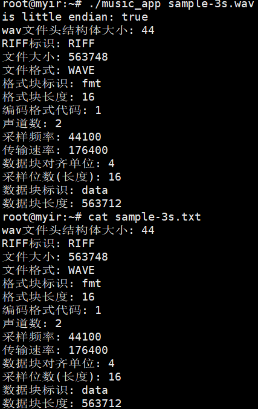

# 第五组 大作业Part1报告
陈敬文 李子睿 刘云

## 实验过程

### 1. 环境配置

#### 1.1 终端连接

用USB Type-B连接Windows电脑, 在设备管理器中发现尚未安装驱动. 下载安装CP2102 USB to UART Bridge VCP Drivers. 安装后可以在设备管理器的`端口(COM和LPT)`中找到串口设备. 在设备管理器中设置波特率为`115200`.

打开Xshell配置串口连接, 配置与设备管理器中的配置相同, 选择对应的端口COM. 连接后再开启单片机可以在终端看到输出.

#### 1.2 网络连接

##### 1.2.1 手动配置单片机和主机IP

将单片机和主机用网线连接, 建立单片机和主机的以太网. 在Windows端配置固定IP. 通过Xshell连接单片机, 设置单片机为另一个固定IP. 随后在Windows端通过ping测试是否可以连通单片机. 使用支持SFTP协议的软件连接单片机, 可以传输文件.

本次实验在Windows以太网设置中, 设置IP为`192.168.3.120`, 掩码`255.255.255.0`, 网关`192.168.3.1`, DNS`192.168.3.1`(DNS设置应该对本实验无影响).

通过Xshell设置单片机IP为`192.168.3.121`, 掩码`255.255.255.0`, 网关`192.168.3.1`. 随后通过ping测试连通性.


```bash
# 单片机
ifconfig eth0 192.168.3.121 netmask 255.255.255.0
route add default gw 192.168.3.1
```

##### 1.2.2 单片机通过DHCP获取IP

校园网需要登录, 直接接入校园网无法通过`udhcpc`或`dhclient`获取IP. 因此本实验未使用该方式.

#### 1.3 交叉编译环境

在Linux环境下安装交叉编译所需的程序即可.

### 2. 程序

#### 2.1 结构体定义

根据wav文件定义, 设计结构体.

```c
struct wav_header{
    char riff[4];        // "RIFF"
    int size;           // size of the file in bytes
    char wave[4];       // "WAVE"
    char fmt[4];        // "fmt "
    int fmt_size;      // size of the fmt chunk
    short format_type; // format type (1 for PCM)
    short channels;     // number of channels
    int sample_rate;   // sample rate
    int byte_rate;     // byte rate
    short block_align; // block align
    short bits_per_sample; // bits per sample
    char data[4];      // "data"
    int data_size;     // size of the data chunk
};
```


#### 2.2 大小端检查

考虑到程序实际运行在单片机上, 因此检查运行程序时主机的大小端状况, 依据情况调整结构体中数据存放方式.

```c
int is_little_endian() {
    unsigned int x = 1; // 0x00000001
    return *((char*)&x); // 如果最低字节是1则是小端

    //大端: [0x00] [0x00] [0x00] [0x01]
    //小端: [0x01] [0x00] [0x00] [0x00]
}
```

```c
//main
if (!is_little_endian()) {
    //wav字符串格式的是大端, 数字格式是小端
    //字符串大端记录是通用的形式
    //如果系统不是小端, 需要将读取的数据转换为大端读取
    
    int_little_to_big((char*)&header.size); // size
    int_little_to_big((char*)&header.fmt_size); // fmt_size
    short_little_to_big((char*)&header.format_type); // format_type
    short_little_to_big((char*)&header.channels); // channels
    int_little_to_big((char*)&header.sample_rate); // sample_rate
    int_little_to_big((char*)&header.byte_rate); // byte_rate
    short_little_to_big((char*)&header.block_align); // block_align
    short_little_to_big((char*)&header.bits_per_sample); // bits_per_sample
    int_little_to_big((char*)&header.data_size); // data_size
}
```

### 2.3. 交叉编译
```bash
$CC music_app.c -o music_app
```
编译后使用SFTP传输可执行文件到单片机中.

### 2.4. 使用说明
```bash
./music_app <wav_file_path>
```
执行后会在wav文件同目录下创建同名的txt文件, 文件中记录了wav文件头信息.

## 实验结果



## 实验心得

### 1. 波特率设置
设备管理器中默认配置的波特率为`9600`, 在Xshell中设置匹配的波特率后, 在单片机启动时会显示乱码. 需要将设备管理器中的波特率和Xshell的波特率调整为`115200`后, 可以正常使用.

### 2. 单片机无法ping通主机
当主机和单片机通过网线连接, 并且配置好以太网后, 主机可以ping到单片机, 但是单片机ping主机时无响应. 这种情况可能是因为Windows主机防火墙拦截了单片机的ICMP包. 但是此时依然可以通过SFTP的方式连接到单片机. 如果将Windows主机的防火墙关闭, 则单片机可以ping通主机.

## wav文件来源
https://samplelib.com/zh/sample-wav.html