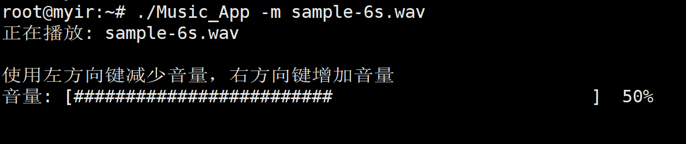

# 第五组 大作业Part2报告
陈敬文 李子睿 刘云

## 实验过程

### 1. 环境配置
在执行编译和目标机器上安装所需库. 因为编译时没有使用静态编译, 因此目标机器上也需要安装所需的库.
```bash
sudo apt install libasound2 libasound2-dev
```

### 2. 程序

### 2.1. wav文件解析
本次作业修改了程序结构, 不再需要手动输入format和rate, 只需要指定待播放的wav文件即可. 通过wav文件头的信息确定所需参数.
```c
// 分析文件头
while((ret = getopt(argc,argv,"m:")) != -1){
    flag = false;
    switch(ret){
        case 'm':
            if(open_music_file(optarg)!=0){
                return 0;
            }
            printf("正在播放: %s \n", optarg);

            rate = wav_header.sample_rate;

            bool little_endian;
            if (strncmp(wav_header.chunk_id, "RIFF", 4) == 0) {
                little_endian = true;
            } else if (strncmp(wav_header.chunk_id, "RIFX", 4) == 0) {
                little_endian = false;
            } else {
                printf("未知文件格式\n");
                return 0;
            }

            switch (wav_header.bits_per_sample) {
            case 16:
                if(little_endian)
                    pcm_format = SND_PCM_FORMAT_S16_LE;
                else
                    pcm_format = SND_PCM_FORMAT_S16_BE;
                break;
            case 24:
                if(little_endian){
                    if(wav_header.block_align == wav_header.num_channels * 4){
                        pcm_format = SND_PCM_FORMAT_S24_LE;
                    }else if(wav_header.block_align == wav_header.num_channels * 3){
                        pcm_format = SND_PCM_FORMAT_S24_3LE;
                    }else{
                        printf("不支持的采样位数: %d\n", wav_header.bits_per_sample);
                        return 0;
                    }
                }else{
                    if(wav_header.block_align == wav_header.num_channels * 4){
                        pcm_format = SND_PCM_FORMAT_S24_BE;
                    }else if(wav_header.block_align == wav_header.num_channels * 3){
                        pcm_format = SND_PCM_FORMAT_S24_3BE;
                    }else{
                        printf("不支持的采样位数: %d\n", wav_header.bits_per_sample);
                        return 0;
                    }
                }
                break;
            case 32:
                if(little_endian)
                    pcm_format = SND_PCM_FORMAT_S32_LE;
                else
                    pcm_format = SND_PCM_FORMAT_S32_BE;
                break;
            default:
                printf("不支持的采样位数: %d\n", wav_header.bits_per_sample);
                return 0;
            }
            break;
    }
}
```

### 2.2. wav播放初始化
首先初始化PCM所需的所有参数, 并在用户空间声明`buff`临时存放wav文件中的部分信息. 该部分涵盖了作业要求中的前9个TODO. 此处修改了`debug_msg()`函数, 便于错误处理.
```c
int init_pcm() {
    if (snd_pcm_hw_params_malloc(&hw_params) < 0) {
        printf("分配snd_pcm_hw_params_t结构体失败\n");
        return 1;
    }

    pcm_name = strdup("default");
    if (snd_pcm_open(&pcm_handle, pcm_name, SND_PCM_STREAM_PLAYBACK, 0) < 0) {
        printf("打开PCM设备失败\n");
		free_pcm_resources();
        return 1;
    }

    if (snd_pcm_hw_params_any(pcm_handle, hw_params) < 0) {
        printf("初始化配置空间失败\n");
        free_pcm_resources();
        return 1;
    }

    if (snd_pcm_hw_params_test_access(pcm_handle, hw_params, SND_PCM_ACCESS_RW_INTERLEAVED) < 0) {
        printf("测试交错模式失败\n");
        free_pcm_resources();
        return 1;
    }

    if (snd_pcm_hw_params_set_format(pcm_handle, hw_params, pcm_format) < 0) {
        printf("设置样本长度失败\n");
       	free_pcm_resources();
        return 1;
    }

    unsigned int exact_rate = rate;
    if (snd_pcm_hw_params_set_rate_near(pcm_handle, hw_params, &exact_rate, 0) < 0) {
        printf("设置采样率失败\n");
        free_pcm_resources();
        return 1;
    }

    if (snd_pcm_hw_params_set_channels(pcm_handle, hw_params, wav_header.num_channels) < 0) {
        printf("设置通道数失败\n");
        free_pcm_resources();
        return 1;
    }

    buffer_size = period_size * periods;
    buff = (unsigned char *)malloc(buffer_size);
    if (!buff) {
        printf("分配缓冲区失败\n");
        free_pcm_resources();
        return 1;
    }

    // 根据采样位数设置缓冲区大小
    if (wav_header.bits_per_sample == 16) {
        frames = buffer_size >> 2;
        if (snd_pcm_hw_params_set_buffer_size(pcm_handle, hw_params, frames) < 0) {
            printf("设置S16_LE OR S16_BE缓冲区失败\n");
            free_pcm_resources();
            return 1;
        }
    } else if (wav_header.bits_per_sample == 24 && wav_header.block_align == wav_header.num_channels * 3) {
        frames = buffer_size / 6;
        if (snd_pcm_hw_params_set_buffer_size(pcm_handle, hw_params, frames) < 0) {
            printf("设置S24_3LE OR S24_3BE缓冲区失败\n");
            free_pcm_resources();
            return 1;
        }
    } else if (wav_header.bits_per_sample == 32 || (wav_header.bits_per_sample == 24 && wav_header.block_align == wav_header.num_channels * 4)) {
        frames = buffer_size >> 3;
        if (snd_pcm_hw_params_set_buffer_size(pcm_handle, hw_params, frames) < 0) {
            printf("设置S32_LE OR S32_BE OR S24_LE OR S24_BE缓冲区失败\n");
            free_pcm_resources();
            return 1;
        }
    }

    if (snd_pcm_hw_params(pcm_handle, hw_params) < 0) {
        printf("设置的硬件配置参数失败\n");
        free_pcm_resources();
        return 1;
    }

	free(pcm_name);
    pcm_name = NULL;
    snd_pcm_hw_params_free(hw_params); // 释放 hw_params
    hw_params = NULL;
    return 0;
}
```

### 2.3. wav播放线程
初始化后, 主进程开启播放线程. 播放线程原理为顺次读取wav文件中的信息, 写入用户声明的`buff`缓冲区, 随后将`buff`写入PCM设备中. 该部分包括最后一个TODO.
```c
void *playback_thread_func(void *arg) {
	int ret;
	// 跳过 WAV 文件头
	fseek(fp, sizeof(struct WAV_HEADER), SEEK_SET);
	// feof函数检测文件结束符，结束：非0, 没结束：0 !feof(fp)
	while(1){
		// 读取文件数据放到缓存中
		ret = fread(buff, 1, buffer_size, fp);
		if(ret == 0){
			// 把输出放到主函数, 避免输出和音量线程干扰
			break;
		}
		
		if(ret < 0){
			printf("\n文件读取错误: %s \n", strerror(errno));
			break;
		}

		// 向PCM设备写入数据,
		while((ret = snd_pcm_writei(pcm_handle, buff, frames)) < 0){
			if (ret == -EPIPE){

				/* EPIPE means underrun -32  的错误就是缓存中的数据不够 */
				printf("\nunderrun occurred -32, err_info = %s \n", snd_strerror(ret));
				//完成硬件参数设置，使设备准备好
				snd_pcm_prepare(pcm_handle);
			
            } else if(ret < 0){
				printf("\nret value is : %d \n", ret);
				printf("\nwrite to audio interface failed: %s \n", snd_strerror(ret));

				if (volume_thread != 0) {
					pthread_cancel(volume_thread);
					pthread_join(volume_thread, NULL);
					volume_thread = 0;
					printf("音量控制线程已取消并退出。\n");
				}

                free_pcm_resources();
                free_mixer_resources();
				if (fp != NULL) {
					fclose(fp);
					fp = NULL;
					printf("音频文件已关闭。\n");
				}

				// 恢复终端模式
				disable_raw_mode();
				printf("终端模式已恢复。\n");

				// 退出程序
				exit(EXIT_FAILURE); // 使用 EXIT_FAILURE 表示程序异常退出
			}
		}
	}
}
```

### 2.4. 音量控制初始化
首先需要初始化控制音量的mixer.
```c
int init_mixer() {
    if (snd_mixer_open(&mixer_handle, 0) < 0) {
        printf("无法打开混音器\n");
        return 1;
    }

    if (snd_mixer_attach(mixer_handle, "default") < 0) {
        printf("无法附加混音器\n");
        free_mixer_resources();
        return 1;
    }

    if (snd_mixer_selem_register(mixer_handle, NULL, NULL) < 0) {
        printf("无法注册混音器控件\n");
        free_mixer_resources();
        return 1;
    }

    if (snd_mixer_load(mixer_handle) < 0) {
        printf("无法加载混音器控件\n");
        free_mixer_resources();
        return 1;
    }

    if (snd_mixer_selem_id_malloc(&sid) < 0) {
        printf("无法分配控件 ID\n");
        free_mixer_resources();
        return 1;
    }

    snd_mixer_selem_id_set_index(sid, 0);
    snd_mixer_selem_id_set_name(sid, "Master");

    elem = snd_mixer_find_selem(mixer_handle, sid);
    if (!elem) {
        printf("无法找到 Master 控件\n");
        free_mixer_resources();
        return 1;
    }

    // 设置初始音量
    long min, max;
    snd_mixer_selem_get_playback_volume_range(elem, &min, &max);
    long set_volume = min + (init_volume * (max - min) / 100);
    snd_mixer_selem_set_playback_volume_all(elem, set_volume);

    snd_mixer_selem_id_free(sid); // 释放 sid
    sid = NULL;
    return 0;
}
```
### 2.5. 音量控制线程
通过在主函数中开启wav播放线程和音量控制线程, 并在音量控制线程中读取用户操作, 使用`snd_mixer_selem_set_playback_volume_all()`函数更新mixer的音量, 即可实现实时的音量控制.

本实验中通过实时获取用户的左右方向键来调整音量. 为了用户体验, 进入程序时, 禁用终端的回显, 行缓冲以及光标, 可以做到实时响应左右方向键.
```c
void enable_raw_mode() {
    struct termios raw;
    tcgetattr(STDIN_FILENO, &orig_termios); // 获取当前终端设置
    raw = orig_termios;
    raw.c_lflag &= ~(ECHO | ICANON); // 禁用回显和行缓冲
    tcsetattr(STDIN_FILENO, TCSAFLUSH, &raw); // 设置终端属性
    printf("\033[?25l"); // 隐藏光标
    fflush(stdout); //立刻生效
}
```
在检测到键盘操作后, 实时更新`volume`变量, 并应用到mixer上. 由于音量播放线程会随时被被动取消, 因此需要保护在操作mixer时, 线程不被中断, 否则会出现主进程无法释放`mixer_handle`.
```c
// 更新完volume后, 限制volume范围
// min_volume = 0, max_volume = 100
if (volume < min_volume) volume = min_volume;
if (volume > max_volume) volume = max_volume;

pthread_setcancelstate(PTHREAD_CANCEL_DISABLE, NULL); // 防止中断
long min, max;
snd_mixer_selem_get_playback_volume_range(elem, &min, &max);
long set_volume = min + (volume * (max - min) / 100);
snd_mixer_selem_set_playback_volume_all(elem, set_volume);
pthread_setcancelstate(PTHREAD_CANCEL_ENABLE, NULL); // 恢复中断
```

### 2.6. 线程间关系
主进程会在wav播放初始化和mixer初始化后, 开启两个线程. 并且阻塞等待播放线程结束. 当播放线程结束后, 主进程请求结束音量控制线程, 并阻塞等待音量控制线程结束.
```c
enable_raw_mode(); // 启用终端非标准模式

pthread_create(&playback_thread, NULL, playback_thread_func, NULL);
pthread_create(&volume_thread, NULL, volume_control_thread, NULL);

pthread_join(playback_thread, NULL); //阻塞等待
playback_thread = 0; // 播放线程退出
pthread_cancel(volume_thread); // 取消音量控制线程
pthread_join(volume_thread, NULL); // 阻塞等待
volume_thread = 0; // 音量控制线程退出

disable_raw_mode(); // 恢复终端标准模式
```

### 2.7. 交叉编译
```bash
# -lasound动态链接ALSA库
# -lpthread动态链接POSIX线程库
$CC Music_App.c -o Music_App -lasound -lpthread
```
编译后使用SFTP传输可执行文件到单片机中.

### 2.8. 使用说明
```bash
./Music_App -m <wav_file_path>
```
执行后会在命令行显示播放文件名, 以及音量控制条. 按下左右方向键可以调整音量.

## 实验结果

播放时界面. 通过调整PulseAudio设置, 可以调节耳机或扬声器音量.


## 实验心得

### 默认情况无法调整扬声器音量
因为PulseAudio驱动似乎无法检测耳机插拔事件, 在插上耳机和拔下耳机时, 执行`pactl list sinks`后均会显示Active Port为`analog-output-headphones`. 因此当拔掉耳机时, 虽然音频可以通过扬声器播放, 但是无法调节音量 (但是调整至0%时可以静音). 如果需要切换Active Port到扬声器, 可以执行
```bash
pactl set-sink-port alsa_output.platform-sound.stereo-fallback analog-output-speaker
```
切换到正确的Active Port后, 可以使用程序正确调整音量.

### 线程中使用`exit()`函数会直接退出进程
使用pthread库中的线程管理时, 线程中退出线程的接口为`pthread_exit()`, 否则使用`exit()`将会退出整个进程, 导致设计的错误处理无法正确完成.

### 线程安全
当播放线程结束, 或主进程收到SIGINT消息后, 会试图结束音量控制线程. 由于音量控制线程在循环更新mixer的音量, 当线程处在`snd_mixer_selem_set_playback_volume_all()`函数执行时被取消, 会导致后续释放资源的`snd_mixer_close(mixer_handle)`无法取消, 程序卡死. 因此本实验在音量控制线程操控mixer附近使用`pthread_setcancelstate(PTHREAD_CANCEL_DISABLE, NULL)`禁用取消消息响应, 保证mixer音量操作的原子性.

## wav文件来源
https://samplelib.com/zh/sample-wav.html